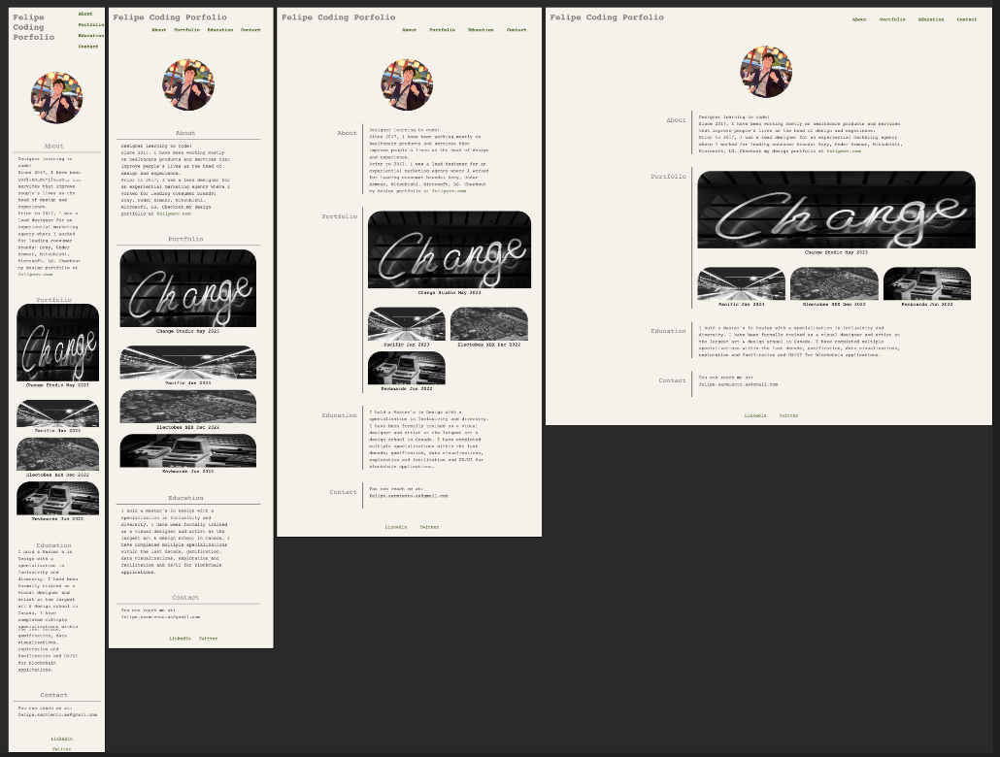

# Coding Portfolio
Display some of my personal and task projects

## Description

Create a portfolio of work where I can showcase my coding skills and talents to employers looking to find a part-time or full-time employee.
The goal of this portfolio is to showcase my HTML and CSS knoweldge without using any Javascript.

The portfolio has with multiple sections, navigation links, classes, id, pseoudo classes and different screen breakpoints.

## Environments

You can view the live portfolio using this link [https://felipewithf.github.io/challenge2-portfolio/](https://felipewithf.github.io/challenge2-portfolio/).

## Responsive

The portfolio was build using only css and html and 4 responsive breakpoints were created:

- Desktop - Original design
- Tablet - max-width 1200px
- mobile - max-width 720px
- legacy mobile - max-width 480px

Below are screenshots of the four breakpoints.

## Credits

This was done as part of a coding challenge and completed within four days for around 6 hours total

## License

MIT

## Tests

Feel free to resize the screen using "inspect" on google chrome or just resizing the window manually to test the responsivenes!
